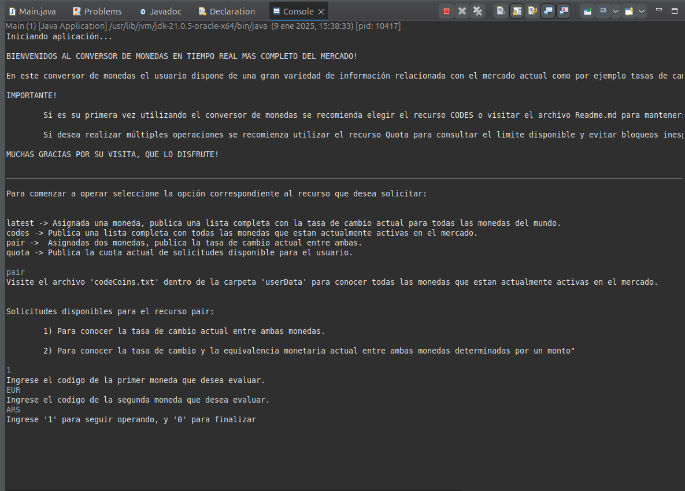

# Conversor de Monedas

## Índice
1. [Estado del Proyecto](#estado-del-proyecto)
2. [Descripción](#descripción)
3. [Funcionalidades](#funcionalidades)
4. [Instrucciones](#Instrucciones)
5. [Requisitos](#requisitos)
6. [Tecnologías Utilizadas](#tecnologías-utilizadas)
7. [Ayuda y Documentación](#ayuda-y-documentación)
8. [Autor](#autor)

---

## Estado del Proyecto
**Back-end finalizado**, con futuras actualizaciones.
**Front-end en proceso** 

---

## Descripción
Este proyecto es un desafío propuesto por **Oracle Education** en asociación con **Alura Latam** que me fue propuesto durante mi formación académica. La aplicación realizada consiste en un conversor de monedas que permite a los usuarios consultar en tiempo real las tasas de cambio actuales en el mercado y las equivalencias monetarias entre diferentes tipos de monedas. 

---

## Funcionalidades

El funcionamiento de la aplicación consiste en el consumo de una API que le permite consumir variedad de recursos a través de 4 endpoints principales, cada uno con funcionalidades específicas: 

1. **`latest`**
   - Permite conocer las tasas de cambio actuales para cada moneda del mercado en relación a una moneda asignada.

2. **`codes`** 
   - Devuelve una lista completa de todas las monedas activas actualmente en el mercado.

3. **`pair`** 
   - **Función 1**: Consulta la tasa de cambio actual entre dos monedas asignadas. 
   - **Función 2**: Calcula la equivalencia monetaria entre dos monedas asignadas basado en un monto específico.

4. **`quota`** 
   - Permite conocer la cuota actual de solicitudes disponibles para el usuario.

Se recomienda recurrir al recurso "quota" en caso de que el usuario requiera realizar múltiples solicitudes a la API y así evitar bloqueos inesperados.

**Ejemplo de uso** 

---

## Instrucciones
### Acceso al Proyecto
1. Clonar o descargar este repositorio desde GitHub.
2. Descargar e instalar un editor de texto o IDE, como **Eclipse**.
3. Abrir el proyecto en el IDE.
4. Ejecutar el programa desde la consola, interactuando con las opciones ofrecidas.
5. Mantener abierta la carpeta `userData` para visualizar los datos generados por las consultas.

---

## Requisitos
- **Java** instalado en el sistema (JDK 11 o superior recomendado).
- Conexión activa a internet para realizar las consultas a la API.
- **IDE** instalado en el sistema para ejecutar el programa. 

---

## Tecnologías Utilizadas
- **JDK (Java Development Kit)**: Herramienta principal para ejecutar programas en Java.
- **Gson**: Librería para la manipulación de datos en formato JSON.
- **Eclipse IDE**: Ambiente de desarrollo integrado utilizado para programar el proyecto.

---

## Ayuda y Documentación
Para más información sobre el funcionamiento de la API utilizada en este proyecto, consulte: 
[Documentación oficial de Exchangerate-API](https://www.exchangerate-api.com/docs/overview)

---

## Autor
Proyecto desarrollado por **Martin24B**. 
Contacto: [alexmartin9c@gmail.com](mailto:alexmartin9c@gmail.com)

---

